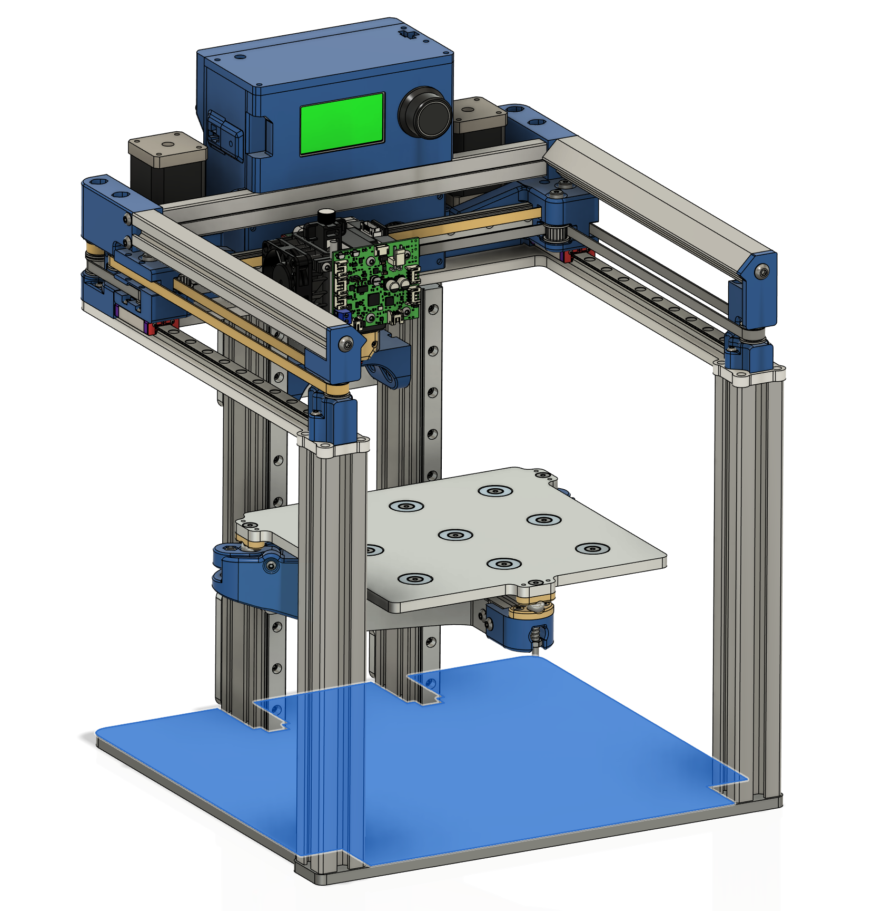
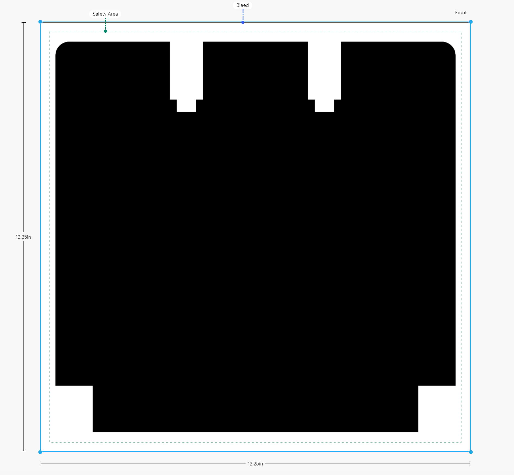

# mod0-Art

- *This project is a work in progress*
- *Expect files to change*
- *Template is subject to change if the shape of the base plate changes*

# Vista Print Car Door Decals

Vista Print offers a service which prints graphics for car door decals. This material adheres extremely well to polycarbonate/acrylic sheets and aluminum. They can be removed and reapplied if done carefully. The sticker is meant to be applied to the base of the machine.

The black area in *base-art-template* represents the area which will be used for the sticker. 

This file is specifically sized for immediate upload to Vista Print for a 12-inch by 12-inch sticker (includes the safety and bleed areas). Note how the file appears when it has been uploaded.

