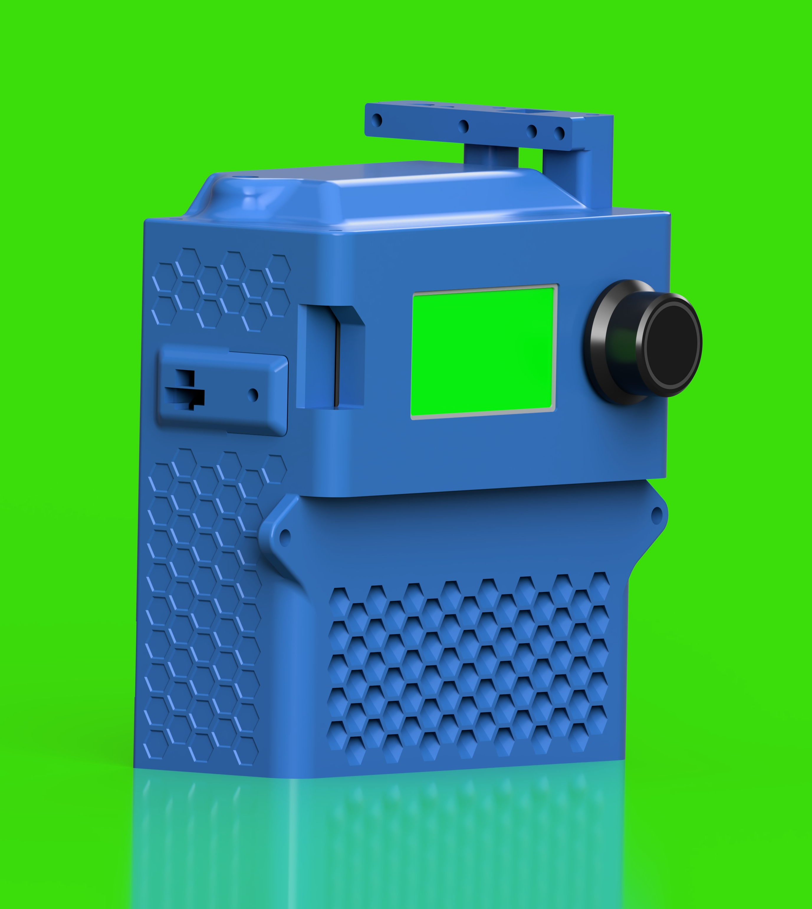

# mod0-brains-duet3mini5
- *This project is a work in progress*
- *Expect files to change*

# mod0-brains-duet3mini5-extraCAN-v1
- Identical to mod0-brains-duet3mini5-v1 except:
  - Added 1x 4p nanofit connector to both side panels
  - Added 3x 4p nanofit connectors to the rear panel
  - Adjusted top/external wire routing to match Klipper brain

# mod0-brains-duet3mini5-v1

