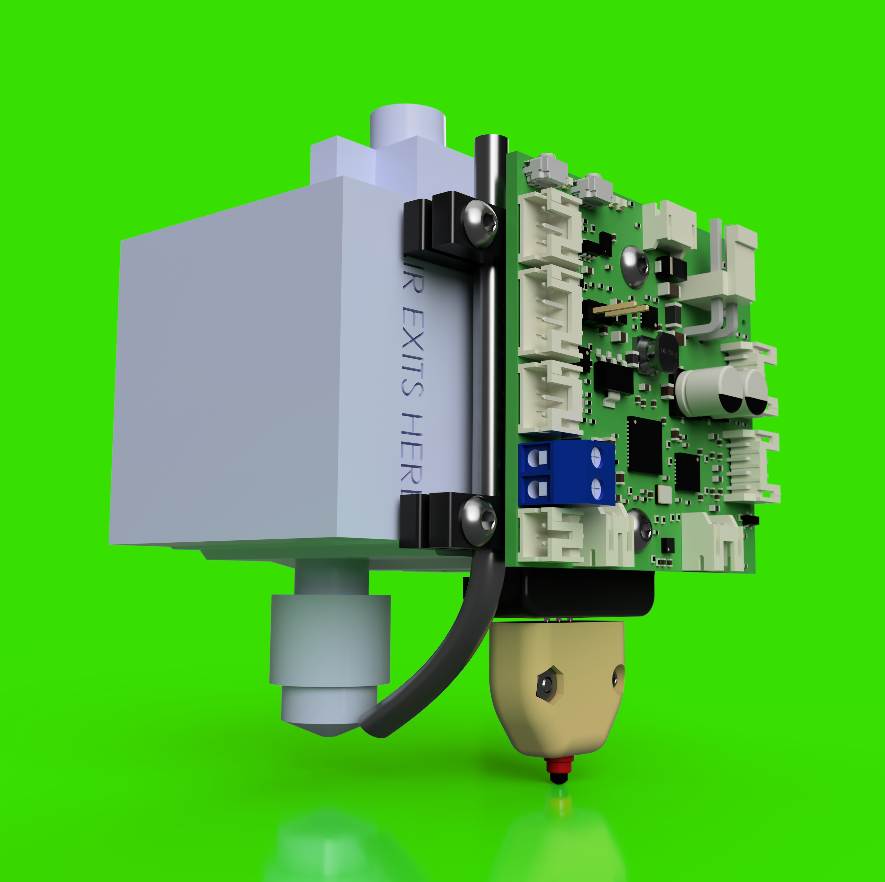

# E3DRevoHemeraXS_DuetCAN_magZ-v1

- *This project is a work in progress*
- *Expect files to change*

## BOM

- Magnetic Connectors - https://www.adafruit.com/product/5360
- Limit Switch - https://www.digikey.com/en/products/detail/omron-electronics-inc-emc-div/D2GW-A02D/15963578

## Reference Models

- Duet Toolboard
  - https://www.duet3d.com/duet3toolboard1lc
  - https://github.com/Duet3D/Duet3-Toolboard-1LC/tree/master/Toolboard_1LC_v1.3
- E3D Hemera XS:
  - https://e3d-online.com/products/revo-hemera-xs
  - https://cdn.shopify.com/s/files/1/0259/1948/8059/files/Hemera_XS_Reference_CAD.STEP?v=1693395523

