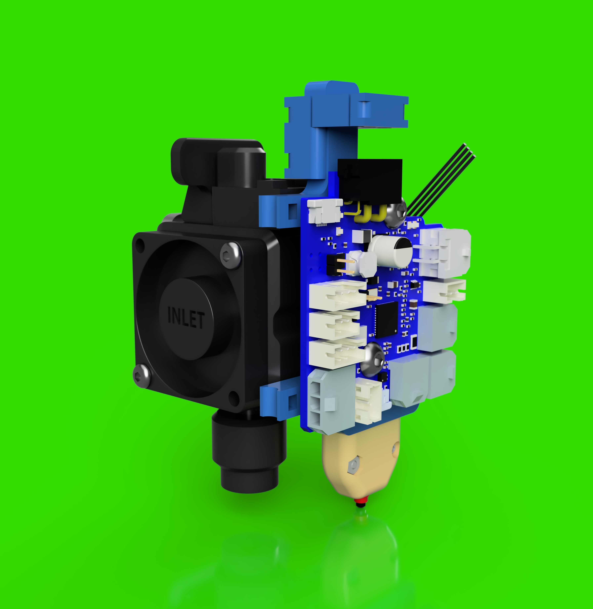

# E3DRevoRoto_DuetCAN_magZ-v1

- *This project is a work in progress*
- *Expect files to change*

## BOM

- Magnetic Connectors - https://www.adafruit.com/product/5360
- Limit Switch - https://www.digikey.com/en/products/detail/omron-electronics-inc-emc-div/D2GW-A02D/15963578

## Reference Models

- Duet Roto Toolboard
  - https://www.duet3d.com/Duet3RotoToolboard
  - https://github.com/Duet3D/Duet3-RotoToolboard
- E3D Roto:
  - https://e3d-online.com/products/roto-extruder
  - https://www.printables.com/model/655950-e3d-roto-reference-cad

