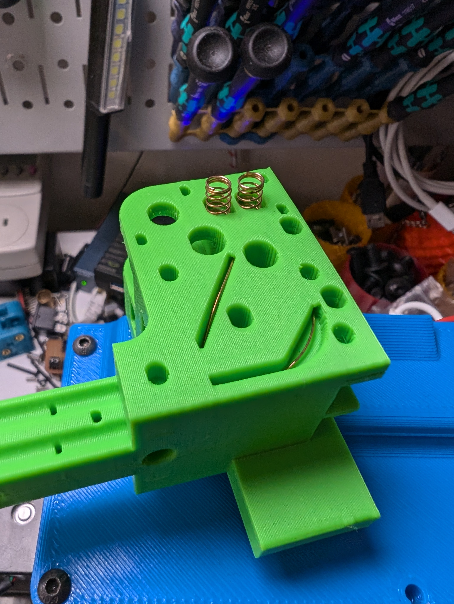
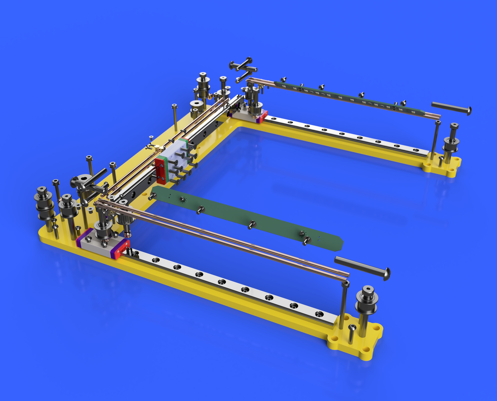

# mod0-xy-180-CAN-Rails
- *This project is a work in progress*
- *Expect files to change*

This adaptation of mod0-xy-180 uses copper rods + target discs to transmit power and CAN signal lines to the extruder/gantry without the need for wiring. There are two copper rods positioned above each y-rail which interface with both ends of the x-rail via target discs using springs to maintain contact with the rods. There is then continuity from the ends of the x-rails to four copper rods which run the length of the x-axis. Four similarly configured target discs with springs on the gantry/extruder complete the circuit from the controller board through the rods on the x-axis.

It is 'somewhat easy' to replace the target discs; they will wear. Wear is greatly exacerbated when the target discs cannot be sprung consistently/smoothly in their mounting holes. The parts that retain the target discs were designed to be small and easy to remove such that they can be printed with a much finer layer height (100 micron recommended). Teardrop shapes have been placed in recesses to facilitate seam placement and help avoid unnecessary friction. It may require printing the parts many times in order to get adequate tolerances to ensure consistent communication and longevity of the target discs. The modular assembly + small part size should minimize waste during these iterations.

Uncoiling the springs and feeding them through the channels can be challenging, it will take practice. Carefully uncoil the spring and make a straight segment to simplify the process. Once the spring has exited the part, carefully pull on the loose end of the spring and it should uncoil into the recess. Leave approximately 6-8mm of spring outside of the recess for adequate compression against the target discs.

## BOM

- Target Discs - https://www.digikey.com/en/products/detail/preci-dip/52051-1P0/22227123
- Copper (101) Rods - https://www.mcmaster.com/catalog/130/4328/8965K35
- Carbon Brushes for Springs - https://www.amazon.com/dp/B09C1HZW7V
- Flat Extrusion - https://us.misumi-ec.com/vona2/detail/110302374340
- Shoulder Bolts - 40mm (M3 thread) - https://us.misumi-ec.com/vona2/detail/110300249140/?HissuCode=MSB5-40
- Shoulder Bolts - 25mm (M4 thread) - https://www.filastruder.com/products/shoulder-screws-bolts?_pos=1&_sid=d9d5dbbc5&_ss=r&variant=16712544124999

