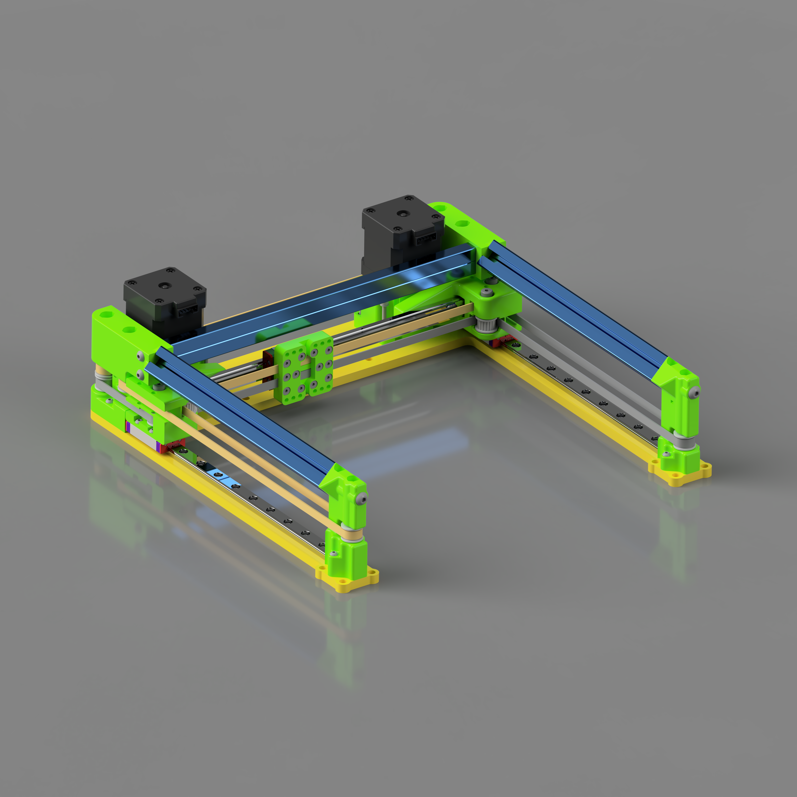
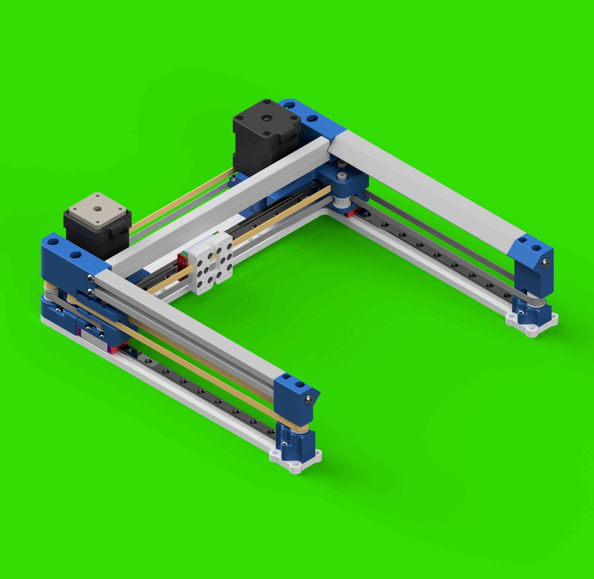

# mod0-xy-175

- *The folder has been renamed to XY-180, every variant in this folder has always had 180x180mm of travel*
- *v1 & v2 files will not be renamed '-180' despite sharing an identical x/y plate with every variant in this folder*
- *This project is a work in progress*
- *Expect files to change*

# mod0-xy-175-v3

## BOM

- Flat Extrusion - https://us.misumi-ec.com/vona2/detail/110302374340
- Shoulder Bolts - 40mm (M3 thread) - https://us.misumi-ec.com/vona2/detail/110300249140/?HissuCode=MSB5-40
- Shoulder Bolts - 25mm (M4 thread) - https://www.filastruder.com/products/shoulder-screws-bolts?_pos=1&_sid=d9d5dbbc5&_ss=r&variant=16712544124999

# mod0-xy-175-v2 (identical to v1 with some cleanup)

## BOM

- 45 Degree Angled Extrusion - https://us.misumi-ec.com/vona2/detail/110302685230/
- Flat Extrusion - https://us.misumi-ec.com/vona2/detail/110302374340
- Shoulder Bolts - 40mm (M3 thread) - https://us.misumi-ec.com/vona2/detail/110300249140/?HissuCode=MSB5-40
- Shoulder Bolts - 25mm (M4 thread) - https://www.filastruder.com/products/shoulder-screws-bolts?_pos=1&_sid=d9d5dbbc5&_ss=r&variant=16712544124999

  

# mod0-xy-175-v1 (deprecated)