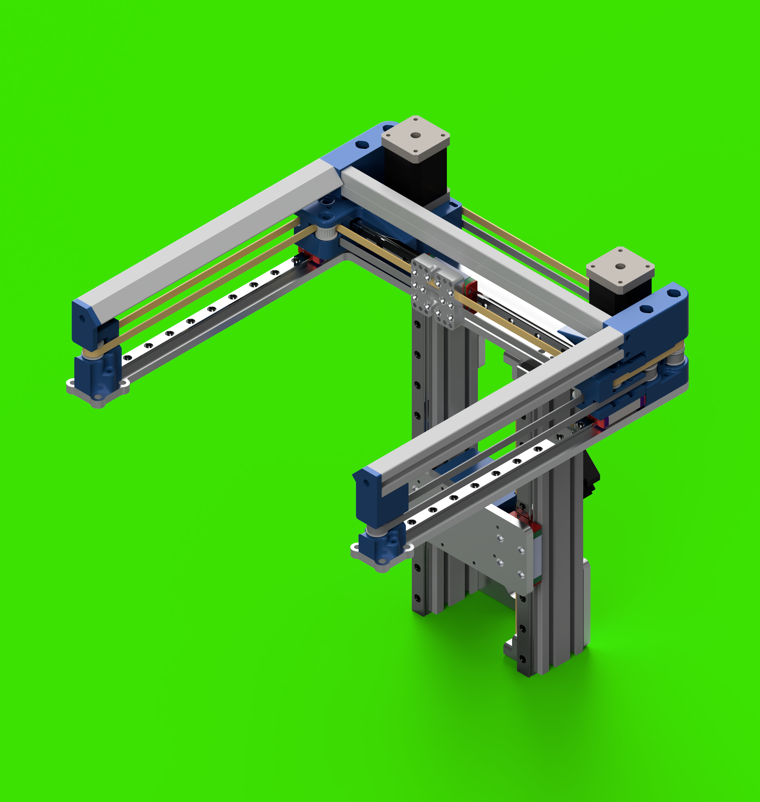
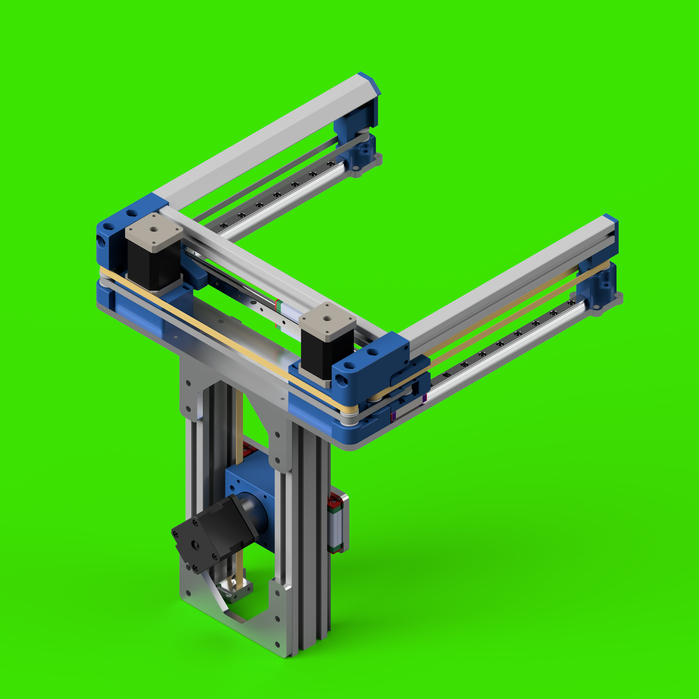

# mod0

### mod0 is an undefined, modular machine platform

- *This project is a work in progress*
- *Modules will be added as they are physically validated*
- *Expect files to change*

## Platform goals

- Extremely simple assembly that will result in precise control with minimal calibration
- Support for any combination of steppers (NEMA14/17), electronics (RRF/Klipper) and extruders
- Subcomponents can be assembled and calibrated independently
- Subcomponents can be separated for travel and quickly reassembled
- Packs flat for travel while staying mostly assembled
- Open Source

Feeling appreciative? Pay it forward! Consider supporting one of these charities!

[Sanjay Mortimer Foundation](https://www.sanjaymortimerfoundation.org/)

[Sanjay Mortimer Foundation PayPal](https://www.paypal.com/donate/?hosted_button_id=VUB6NVF83EH5J)

