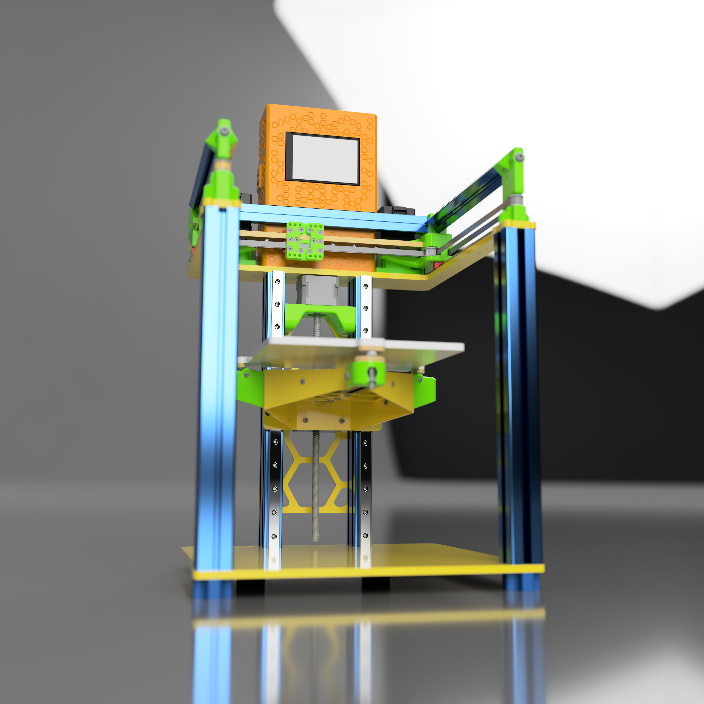
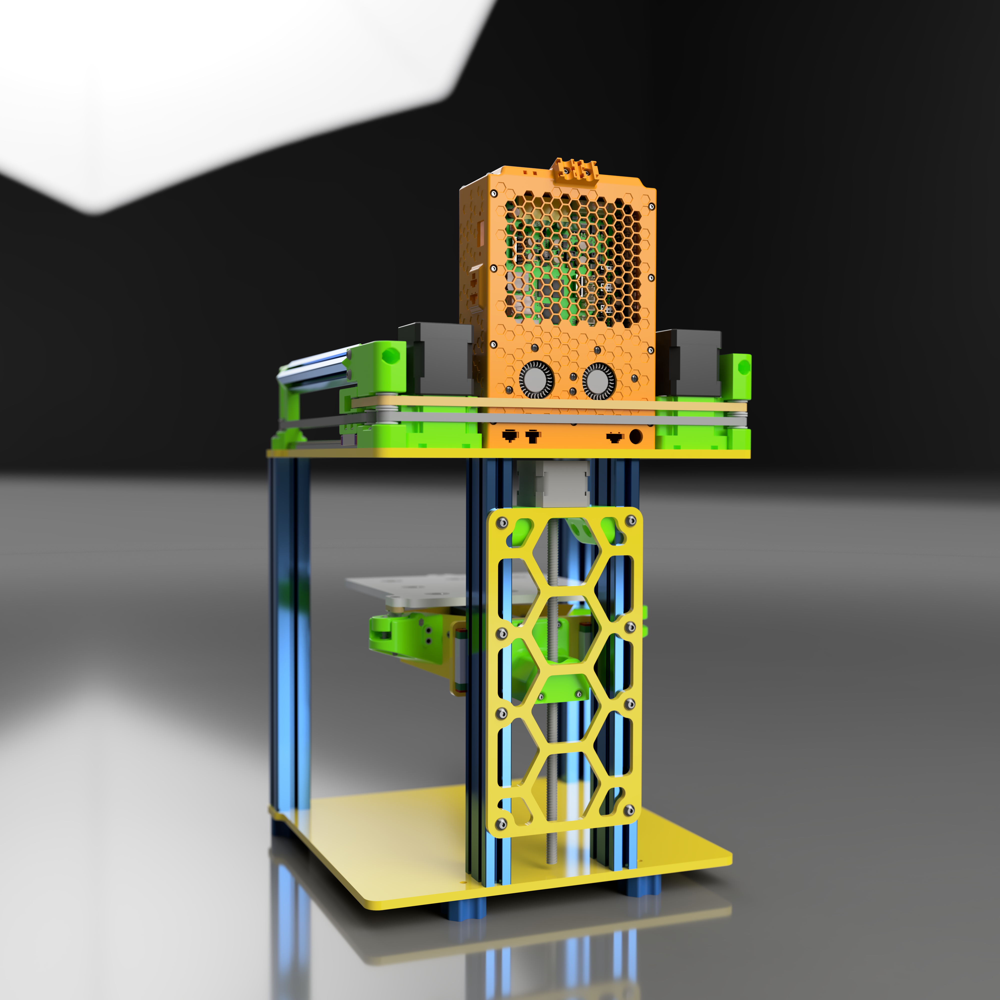

# mod0

### mod0 is an undefined, modular machine platform

This project is a work in progress. Files are provided as-is for research purposes only. **Expect files to be continuously changing.**

## Platform goals

- Simple assembly
- Subcomponents can be assembled and calibrated independently
- Subcomponents can be separated for travel and quickly reassembled
- Packs flat for travel while staying mostly assembled
- Open Source

Feeling appreciative? Pay it forward! Consider supporting one of these charities!

[Sanjay Mortimer Foundation](https://www.sanjaymortimerfoundation.org/)

[Sanjay Mortimer Foundation PayPal](https://www.paypal.com/donate/?hosted_button_id=VUB6NVF83EH5J)

